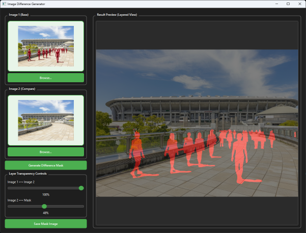

# Image Difference Generator

[日本語版 README はこちら / Japanese README](README.md)

A PyQt6 GUI application that extracts differences between two images and outputs them as a mask image.



## Overview

This application compares two images, detects differences, and outputs the difference regions as a mask image with an alpha channel. Perfect for image editing, quality checking, and change detection tasks.

## Key Features

### 🎨 GUI
- Dark theme interface
- Intuitive operation
- Real-time preview

### 🖼️ Image Input
- **Drag and Drop Support**: Simply drag images into the drop zones to load them
- **Thumbnail Display**: Automatically displays thumbnails of loaded images
- **Browse Function**: Select images via file selection dialog
- **Supported Formats**: PNG, JPEG, BMP, TIFF, WebP

### 🔍 Difference Detection
- Automatically detects differences between two images
- High-precision pixel-level comparison
- Noise removal through morphological processing
- Clear mask generation with threshold processing

### 📊 Layer Display
Display images in 3 layers (Image 1 → Image 2 → Mask):
- **Slider 1**: Adjust transparency between Image 1 and Image 2
  - 0%: Display Image 1 only
  - 100%: Display Image 2 only
  - Mid values: Blend both images
- **Slider 2**: Adjust transparency between Image 2 and Mask
  - 0%: Display Image 2 only
  - 100%: Display Mask only (differences highlighted in red)
  - Mid values: Overlay mask

### 💾 Export Function
- Save mask image in PNG format
- Output with alpha channel
- Opaque (white) where differences exist, transparent where none

## Installation

### Requirements
- Python 3.8 or higher
- pip (package manager)

### Setup Instructions

1. Clone this repository:
```bash
git clone <repository-url>
cd image-diff-generator
```

2. Install dependencies:
```bash
pip install -r requirements.txt
```

Required packages:
- `PyQt6` (>= 6.6.0): GUI framework
- `opencv-python` (>= 4.8.0): Image processing
- `numpy` (>= 1.24.0): Numerical operations

## Usage

### Basic Usage

1. **Launch the application**:
```bash
python main.py
```

2. **Load images**:
   - Drag and drop **Image 1** (base image) into the left drop zone
   - Drag and drop **Image 2** (comparison image) into the right drop zone
   - Or click the "Browse..." button to select files
   - Loaded images will be displayed as thumbnails

3. **Generate difference mask**:
   - The "Generate Difference Mask" button becomes enabled after loading both images
   - Click the button to execute difference detection
   - Results will be displayed in the preview panel on the right

4. **Adjust display**:
   - **Image 1 ⟷ Image 2 Slider**: Transition between the two source images
   - **Image 2 ⟷ Mask Slider**: Adjust visibility of the difference mask
   - Move the sliders to find the optimal display

5. **Save mask image**:
   - Click the "Save Mask Image" button
   - Specify the save destination and filename
   - The mask will be saved in PNG format with alpha channel

### Use Cases

#### Case 1: Document Change Checking
- Compare screenshots before and after modifications
- Changed areas are clearly displayed in the mask

#### Case 2: Image Editing Verification
- Compare images before and after editing
- Visualize retouched or modified areas

#### Case 3: Quality Control
- Compare reference image with inspection target
- Automatically detect defects or mismatches

## How It Works

### Difference Detection Algorithm

1. **Image Normalization**:
   - Resize both images to the same size (using the larger dimensions)

2. **Difference Calculation**:
   - Calculate absolute difference for each pixel using OpenCV's `cv2.absdiff()`
   - Compute differences across BGR channels

3. **Grayscale Conversion**:
   - Convert color differences to grayscale

4. **Binarization**:
   - Apply threshold (default: 30) to generate binary mask
   - Detect pixels where difference exceeds threshold

5. **Noise Removal**:
   - Remove noise with morphological operations (closing/opening)
   - Using 5x5 kernel

6. **Mask Generation**:
   - Mark difference areas in red
   - Control transparency with alpha channel

### Layer Composition

- Use `cv2.addWeighted()` to composite multiple images with transparency
- Adjust composition ratio in real-time based on slider values

## Project Structure

```
image-diff-generator/
├── main.py              # Main application
├── requirements.txt     # Python dependencies
├── README.md           # Japanese README
└── README.en.md        # This file (English README)
```

## Main Code Classes

### `DropLabel`
- Custom QLabel widget with drag and drop support
- Accepts image files and displays thumbnails
- Automatic detection of supported file formats

### `ImageDiffViewer`
- Custom widget for compositing and displaying 3 layers
- Real-time transparency control
- Scaling while maintaining aspect ratio

### `MainWindow`
- Main application window
- Integrates UI construction and image processing logic
- Event handling and file I/O

## Customization

### Adjust Difference Detection Sensitivity

Change the threshold around `main.py:400`:
```python
_, binary_mask = cv2.threshold(gray_diff, 30, 255, cv2.THRESH_BINARY)
```
- Lower value (e.g., 10) → Detect subtle differences (high sensitivity)
- Higher value (e.g., 50) → Detect only major differences (low sensitivity)

### Change Mask Color

Change channel specification around `main.py:410`:
```python
self.mask[:, :, 2] = binary_mask  # Red channel
# self.mask[:, :, 1] = binary_mask  # Green channel
# self.mask[:, :, 0] = binary_mask  # Blue channel
```

## Troubleshooting

### Cannot load images
- Verify supported formats (PNG, JPEG, BMP, TIFF, WebP)
- Check if files are corrupted
- If file path contains non-ASCII characters, try using ASCII-only paths

### No differences detected
- The two images may be completely identical
- Try lowering the sensitivity (threshold)
- Images may differ slightly due to compression

### Application won't start
- Verify Python 3.8 or higher is installed
- Verify dependencies are correctly installed:
```bash
pip list | grep PyQt6
pip list | grep opencv-python
```

## License

This project is open source. Feel free to use and modify.

## Contributing

Bug reports and feature requests are welcome via Issues. Pull requests are also welcome.

## Future Enhancements

- [ ] Multiple difference detection algorithm options
- [ ] Batch processing (multiple image pairs at once)
- [ ] Difference statistics display (changed pixel count, change rate, etc.)
- [ ] Heatmap display option
- [ ] Custom color maps
- [ ] Automatic cropping of difference regions
